# DNSCTL - 云解析DNS工具

该项目主要是基于阿里云、腾讯云(Dnspod)等云解析DNS开放的API编写的客户端工具。

## 手册

- [x] [阿里云 DNS 客户端工具使用手册](./docs/DNSCTL-ALIYUN.md)
- [x] [腾讯云 DNS 客户端工具使用手册](./docs/DNSCTL-TENCENT.md)

## 帮助

-  Dnsctl - 一个 `aliyun` 和 `tencent` 集合的工具，即同时拥有管理阿里云解析DNS和腾讯云解析DNS功能。

```bash
dnsctl is a simple command line client for cloud dns.

Usage:
  dnsctl [command]

Available Commands:
  aliyun      阿里云 云DNS
  help        Help about any command
  tencent     腾讯云 云DNS
  version     版本号

Flags:
  -h, --help   help for dnsctl

Use "dnsctl [command] --help" for more information about a command.
```

- Aliyun

```bash
dnsctl-aliyun is a simple command line client for aliyun dns.

Usage:
  dnsctl-aliyun [command]

Available Commands:
  domain      域名管理
  group       域名分组管理
  help        Help about any command
  record      域名解析管理
  version     版本号

Flags:
      --access-key-id string       密钥ID
      --access-key-secret string   加密密钥
  -h, --help                       help for dnsctl-aliyun
      --region-id string           区域ID (default "default")

Use "dnsctl-aliyun [command] --help" for more information about a command.
```

- Tencent

```bash
dnsctl-tencent is a simple command line client for tencent dns.

Usage:
  dnsctl-tencent [command]

Available Commands:
  domain      域名管理
  group       域名分组管理
  help        Help about any command
  record      域名解析管理
  version     版本号

Flags:
  -h, --help                help for dnsctl-tencent
      --region string       区域名称
      --secret-id string    密钥ID
      --secret-key string   加密密钥

Use "dnsctl-tencent [command] --help" for more information about a command.
```

## 样例

- Aliyun

```bash
# 配置鉴权信息
export ALIYUN_ACCESS_KEY_ID=xxxx
export ALIYUN_ACCESS_SECRET_ID=yyyy

# 添加域名分组
dnsctl-aliyun group add --name 测试分组
# 获取域名分组列表
dnsctl-aliyun group list

# 添加域名
$ dnsctl-aliyun domain add --name yuntree.com
# 添加域名备注
dnsctl-aliyun domain remark --name yuntree.com --remark 国际域名
# 获取域名列表
$ dnsctl-aliyun domain list

# 添加解析记录
$ dnsctl-aliyun record add --domain yuntree.com --rr cdn --type A --value 8.8.8.8
$ dnsctl-aliyun record add --domain yuntree.com --rr www --type A --value 1.1.1.1
# 添加域名解析备注
$ dnsctl-aliyun record remark --id 721418058676111360 --remark 官网
$ dnsctl-aliyun record remark --id 721418057214420992 --remark CDN分发
# 设置域名解析状态
$ dnsctl-aliyun record status --id 721418057214420992 --status DISABLE
# 获取域名解析列表
$ dnsctl-aliyun record list --domain yuntree.com

# 查看操作日志
$ dnsctl-aliyun domain logs --lang zh
$ dnsctl-aliyun record logs --domain yuntree.com --lang zh
```

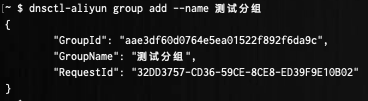

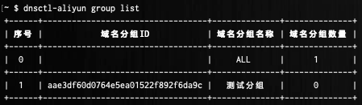

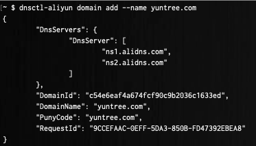

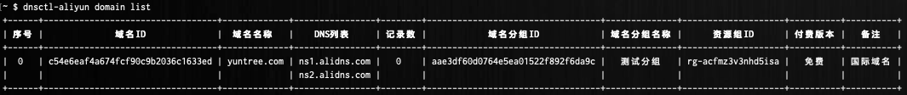

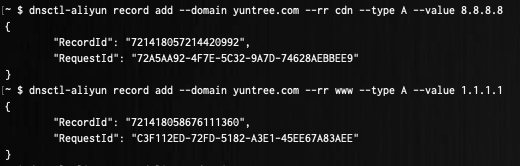

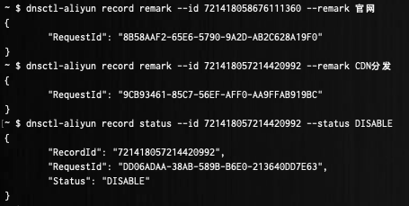

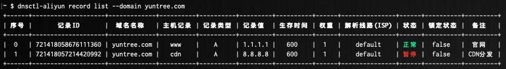

- Tencent

```bash
# 配置鉴权信息
export TENCENT_SECRET_ID=xxxx
export TENCENT_SECRET_KEY=yyyy

# 添加域名分组
$ dnsctl-tencent group add --name 测试分组
# 获取域名分组列表
$ dnsctl-tencent group list

# 添加域名
$ dnsctl-tencent domain add --name yuntree.com
# 添加域名备注
$ dnsctl-tencent domain remark --name yuntree.com --remark 国际域名
# 获取域名列表
$ dnsctl-tencent domain list

# 添加解析记录
$ dnsctl-tencent record add --domain yuntree.com --rr www --type A --value 1.1.1.1
$ dnsctl-tencent record add --domain yuntree.com --rr cdn --type A --value 8.8.8.8
# 添加域名解析备注
$ dnsctl-tencent record remark --domain yuntree.com --id 927117504 --remark 官网
$ dnsctl-tencent record remark --domain yuntree.com --id 927117560 --remark CDN分发
# 设置域名解析状态
$ dnsctl-tencent record status --domain yuntree.com --id 927117560 --status DISABLE
# 获取域名解析列表
$ dnsctl-tencent record list --domain yuntree.com

# 查看操作日志
$ dnsctl-aliyun domain logs --name yuntree.com
```

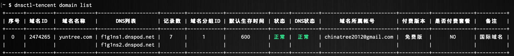

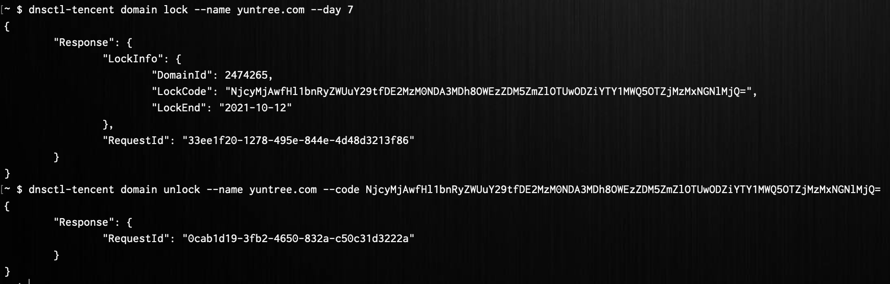

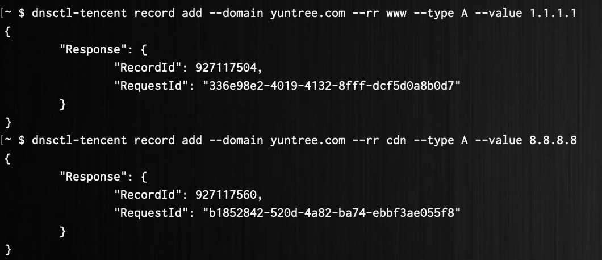

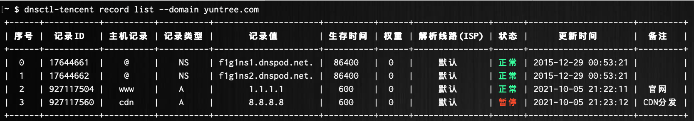

## 构建

- 二进制

```bash
git clone github.com/chinatree/dnsctl.git
cd dnsctl
make build

# 基于容器构建
make build-in-docker
```

- 容器

```bash
git clone github.com/chinatree/dnsctl.git
cd dnsctl

## 单架构
BUILD_FROM="alpine:3.14.2"
IMAGE="chinatree/dnsctl:0.0.1-alpine"
docker build --no-cache \
	-t ${IMAGE} \
	--build-arg BUILD_FROM=${BUILD_FROM} \
	-f build/docker/Dockerfile \
	./build/docker

## 多架构
BUILD_FROM="alpine:3.14.2"
IMAGE="chinatree/dnsctl:0.0.1-alpine"
docker buildx build --no-cache \
	-t ${IMAGE} \
	--build-arg BUILD_FROM=${BUILD_FROM} \
	-f build/docker/Dockerfile \
	./build/docker \
	--platform=linux/amd64,linux/arm64 \
	--push


# Aliyun
## 单架构
BUILD_FROM="alpine:3.14.2"
IMAGE="chinatree/dnsctl-aliyun:0.0.1-alpine"
docker build --no-cache \
	-t ${IMAGE} \
	--build-arg BUILD_FROM=${BUILD_FROM} \
	-f build/docker/Dockerfile-Aliyun \
	./build/docker

## 多架构
BUILD_FROM="alpine:3.14.2"
IMAGE="chinatree/dnsctl-aliyun:0.0.1-alpine"
docker buildx build --no-cache \
	-t ${IMAGE} \
	--build-arg BUILD_FROM=${BUILD_FROM} \
	-f build/docker/Dockerfile-Aliyun \
	./build/docker \
	--platform=linux/amd64,linux/arm64 \
	--push


# Tencent
## 单架构
BUILD_FROM="alpine:3.14.2"
IMAGE="chinatree/dnsctl-tencent:0.0.1-alpine"
docker build --no-cache \
	-t ${IMAGE} \
	--build-arg BUILD_FROM=${BUILD_FROM} \
	-f build/docker/Dockerfile-Tencent \
	./build/docker

## 多架构
BUILD_FROM="alpine:3.14.2"
IMAGE="chinatree/dnsctl-tencent:0.0.1-alpine"
docker buildx build --no-cache \
	-t ${IMAGE} \
	--build-arg BUILD_FROM=${BUILD_FROM} \
	-f build/docker/Dockerfile-Tencent \
	./build/docker \
	--platform=linux/amd64,linux/arm64 \
	--push
```

## 容器

- `chinatree/dnsctl:0.0.1-alpine`

```bash
docker run -it --rm \
	-e ALIYUN_ACCESS_KEY_ID=xxxx \
	-e ALIYUN_ACCESS_SECRET_ID=yyyy \
	-e TENCENT_SECRET_ID=xxxx \
	-e TENCENT_SECRET_KEY=yyyy \
	chinatree/dnsctl:0.0.1-alpine
```

- `chinatree/dnsctl-aliyun:0.0.1-alpine`

```bash
docker run -it --rm \
	-e ALIYUN_ACCESS_KEY_ID=xxxx \
	-e ALIYUN_ACCESS_SECRET_ID=yyyy \
	chinatree/dnsctl-aliyun:0.0.1-alpine
```

- `chinatree/dnsctl-tencent:0.0.1-alpine`

```bash
docker run -it --rm \
	-e TENCENT_SECRET_ID=xxxx \
	-e TENCENT_SECRET_KEY=yyyy \
	chinatree/dnsctl-tencent:0.0.1-alpine
```

## 协议

Dnsctl is released under the very permissive [MIT license](LICENSE).
